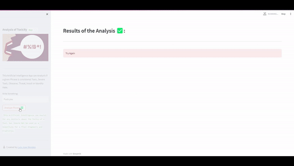
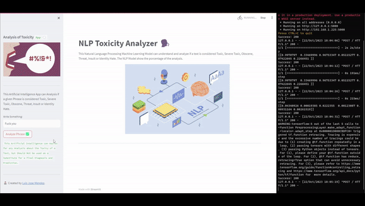

# NLP Toxicity Analyzer with TensorFlow, LSTM and Streamlit



##  NLP Toxicity Analyzer with TensorFlow, LSTM, and Streamlit

The NLP Model was trained with Toxic and not Toxis Phrases and with the `LSTM` Neural Network Architecture. This Natural Language Processing Deep Learning Model can understand and analyze if a text is considered Toxic, Severe Toxic, Obscene, Threat, Insult or Identity Hate. The NLP Model show the porcentage of the analysis.

## Run it Locally

Test it Locally by running the `app.py` file, built with `Streamlit`, and the `api.py` file with `Flask`. Remember first to run the `api.py` and then the `app.py` file.

## App made with Streamlit
```sh
streamlit run app.py
```

## Deployed with Flash
```sh
python3 api.py
```



